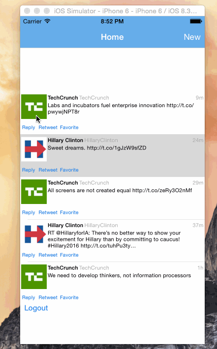

# Twitter iOS Application Redux

Time spent: 32 hours spent in total

Completed user stories:

Hamburger menu
* [x] Dragging anywhere in the view should reveal the menu.
* [x] The menu should include links to your profile, the home timeline, and the mentions view.

Profile page
* [x] Contains the user header view
* [x] Contains a section with the users basic stats: # tweets, # following, # followers
* [ ] Optional: Implement the paging view for the user description.
* [ ] Optional: As the paging view moves, increase the opacity of the background screen.
* [ ] Optional: Pulling down the profile page should blur and resize the header image.

Home Timeline
* [ ] Tapping on a user image should bring up that user's profile page
* [ ] Optional: Account switching
* [ ] Long press on tab bar to bring up Account view with animation
* [ ] Tap account to switch to
* [ ] Include a plus button to Add an Account
* [ ] Swipe to delete an account

